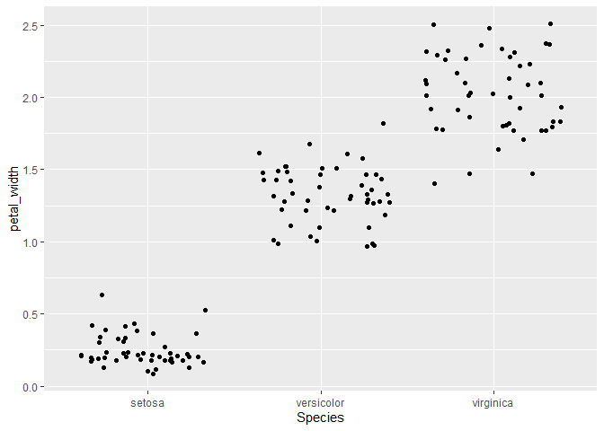

Lab 5 Assignment
================
Michael Slaughter
2021-02-24

“Welcome To My Lab 5 Assignment”

Here is where we load in the data

``` r
library(tidyverse)
```

    ## -- Attaching packages --------------------------------------- tidyverse 1.3.0 --

    ## v ggplot2 3.3.3     v purrr   0.3.4
    ## v tibble  3.0.5     v dplyr   1.0.3
    ## v tidyr   1.1.2     v stringr 1.4.0
    ## v readr   1.4.0     v forcats 0.5.0

    ## -- Conflicts ------------------------------------------ tidyverse_conflicts() --
    ## x dplyr::filter() masks stats::filter()
    ## x dplyr::lag()    masks stats::lag()

``` r
iris
```

    ##     Sepal.Length Sepal.Width Petal.Length Petal.Width    Species
    ## 1            5.1         3.5          1.4         0.2     setosa
    ## 2            4.9         3.0          1.4         0.2     setosa
    ## 3            4.7         3.2          1.3         0.2     setosa
    ## 4            4.6         3.1          1.5         0.2     setosa
    ## 5            5.0         3.6          1.4         0.2     setosa
    ## 6            5.4         3.9          1.7         0.4     setosa
    ## 7            4.6         3.4          1.4         0.3     setosa
    ## 8            5.0         3.4          1.5         0.2     setosa
    ## 9            4.4         2.9          1.4         0.2     setosa
    ## 10           4.9         3.1          1.5         0.1     setosa
    ## 11           5.4         3.7          1.5         0.2     setosa
    ## 12           4.8         3.4          1.6         0.2     setosa
    ## 13           4.8         3.0          1.4         0.1     setosa
    ## 14           4.3         3.0          1.1         0.1     setosa
    ## 15           5.8         4.0          1.2         0.2     setosa
    ## 16           5.7         4.4          1.5         0.4     setosa
    ## 17           5.4         3.9          1.3         0.4     setosa
    ## 18           5.1         3.5          1.4         0.3     setosa
    ## 19           5.7         3.8          1.7         0.3     setosa
    ## 20           5.1         3.8          1.5         0.3     setosa
    ## 21           5.4         3.4          1.7         0.2     setosa
    ## 22           5.1         3.7          1.5         0.4     setosa
    ## 23           4.6         3.6          1.0         0.2     setosa
    ## 24           5.1         3.3          1.7         0.5     setosa
    ## 25           4.8         3.4          1.9         0.2     setosa
    ## 26           5.0         3.0          1.6         0.2     setosa
    ## 27           5.0         3.4          1.6         0.4     setosa
    ## 28           5.2         3.5          1.5         0.2     setosa
    ## 29           5.2         3.4          1.4         0.2     setosa
    ## 30           4.7         3.2          1.6         0.2     setosa
    ## 31           4.8         3.1          1.6         0.2     setosa
    ## 32           5.4         3.4          1.5         0.4     setosa
    ## 33           5.2         4.1          1.5         0.1     setosa
    ## 34           5.5         4.2          1.4         0.2     setosa
    ## 35           4.9         3.1          1.5         0.2     setosa
    ## 36           5.0         3.2          1.2         0.2     setosa
    ## 37           5.5         3.5          1.3         0.2     setosa
    ## 38           4.9         3.6          1.4         0.1     setosa
    ## 39           4.4         3.0          1.3         0.2     setosa
    ## 40           5.1         3.4          1.5         0.2     setosa
    ## 41           5.0         3.5          1.3         0.3     setosa
    ## 42           4.5         2.3          1.3         0.3     setosa
    ## 43           4.4         3.2          1.3         0.2     setosa
    ## 44           5.0         3.5          1.6         0.6     setosa
    ## 45           5.1         3.8          1.9         0.4     setosa
    ## 46           4.8         3.0          1.4         0.3     setosa
    ## 47           5.1         3.8          1.6         0.2     setosa
    ## 48           4.6         3.2          1.4         0.2     setosa
    ## 49           5.3         3.7          1.5         0.2     setosa
    ## 50           5.0         3.3          1.4         0.2     setosa
    ## 51           7.0         3.2          4.7         1.4 versicolor
    ## 52           6.4         3.2          4.5         1.5 versicolor
    ## 53           6.9         3.1          4.9         1.5 versicolor
    ## 54           5.5         2.3          4.0         1.3 versicolor
    ## 55           6.5         2.8          4.6         1.5 versicolor
    ## 56           5.7         2.8          4.5         1.3 versicolor
    ## 57           6.3         3.3          4.7         1.6 versicolor
    ## 58           4.9         2.4          3.3         1.0 versicolor
    ## 59           6.6         2.9          4.6         1.3 versicolor
    ## 60           5.2         2.7          3.9         1.4 versicolor
    ## 61           5.0         2.0          3.5         1.0 versicolor
    ## 62           5.9         3.0          4.2         1.5 versicolor
    ## 63           6.0         2.2          4.0         1.0 versicolor
    ## 64           6.1         2.9          4.7         1.4 versicolor
    ## 65           5.6         2.9          3.6         1.3 versicolor
    ## 66           6.7         3.1          4.4         1.4 versicolor
    ## 67           5.6         3.0          4.5         1.5 versicolor
    ## 68           5.8         2.7          4.1         1.0 versicolor
    ## 69           6.2         2.2          4.5         1.5 versicolor
    ## 70           5.6         2.5          3.9         1.1 versicolor
    ## 71           5.9         3.2          4.8         1.8 versicolor
    ## 72           6.1         2.8          4.0         1.3 versicolor
    ## 73           6.3         2.5          4.9         1.5 versicolor
    ## 74           6.1         2.8          4.7         1.2 versicolor
    ## 75           6.4         2.9          4.3         1.3 versicolor
    ## 76           6.6         3.0          4.4         1.4 versicolor
    ## 77           6.8         2.8          4.8         1.4 versicolor
    ## 78           6.7         3.0          5.0         1.7 versicolor
    ## 79           6.0         2.9          4.5         1.5 versicolor
    ## 80           5.7         2.6          3.5         1.0 versicolor
    ## 81           5.5         2.4          3.8         1.1 versicolor
    ## 82           5.5         2.4          3.7         1.0 versicolor
    ## 83           5.8         2.7          3.9         1.2 versicolor
    ## 84           6.0         2.7          5.1         1.6 versicolor
    ## 85           5.4         3.0          4.5         1.5 versicolor
    ## 86           6.0         3.4          4.5         1.6 versicolor
    ## 87           6.7         3.1          4.7         1.5 versicolor
    ## 88           6.3         2.3          4.4         1.3 versicolor
    ## 89           5.6         3.0          4.1         1.3 versicolor
    ## 90           5.5         2.5          4.0         1.3 versicolor
    ## 91           5.5         2.6          4.4         1.2 versicolor
    ## 92           6.1         3.0          4.6         1.4 versicolor
    ## 93           5.8         2.6          4.0         1.2 versicolor
    ## 94           5.0         2.3          3.3         1.0 versicolor
    ## 95           5.6         2.7          4.2         1.3 versicolor
    ## 96           5.7         3.0          4.2         1.2 versicolor
    ## 97           5.7         2.9          4.2         1.3 versicolor
    ## 98           6.2         2.9          4.3         1.3 versicolor
    ## 99           5.1         2.5          3.0         1.1 versicolor
    ## 100          5.7         2.8          4.1         1.3 versicolor
    ## 101          6.3         3.3          6.0         2.5  virginica
    ## 102          5.8         2.7          5.1         1.9  virginica
    ## 103          7.1         3.0          5.9         2.1  virginica
    ## 104          6.3         2.9          5.6         1.8  virginica
    ## 105          6.5         3.0          5.8         2.2  virginica
    ## 106          7.6         3.0          6.6         2.1  virginica
    ## 107          4.9         2.5          4.5         1.7  virginica
    ## 108          7.3         2.9          6.3         1.8  virginica
    ## 109          6.7         2.5          5.8         1.8  virginica
    ## 110          7.2         3.6          6.1         2.5  virginica
    ## 111          6.5         3.2          5.1         2.0  virginica
    ## 112          6.4         2.7          5.3         1.9  virginica
    ## 113          6.8         3.0          5.5         2.1  virginica
    ## 114          5.7         2.5          5.0         2.0  virginica
    ## 115          5.8         2.8          5.1         2.4  virginica
    ## 116          6.4         3.2          5.3         2.3  virginica
    ## 117          6.5         3.0          5.5         1.8  virginica
    ## 118          7.7         3.8          6.7         2.2  virginica
    ## 119          7.7         2.6          6.9         2.3  virginica
    ## 120          6.0         2.2          5.0         1.5  virginica
    ## 121          6.9         3.2          5.7         2.3  virginica
    ## 122          5.6         2.8          4.9         2.0  virginica
    ## 123          7.7         2.8          6.7         2.0  virginica
    ## 124          6.3         2.7          4.9         1.8  virginica
    ## 125          6.7         3.3          5.7         2.1  virginica
    ## 126          7.2         3.2          6.0         1.8  virginica
    ## 127          6.2         2.8          4.8         1.8  virginica
    ## 128          6.1         3.0          4.9         1.8  virginica
    ## 129          6.4         2.8          5.6         2.1  virginica
    ## 130          7.2         3.0          5.8         1.6  virginica
    ## 131          7.4         2.8          6.1         1.9  virginica
    ## 132          7.9         3.8          6.4         2.0  virginica
    ## 133          6.4         2.8          5.6         2.2  virginica
    ## 134          6.3         2.8          5.1         1.5  virginica
    ## 135          6.1         2.6          5.6         1.4  virginica
    ## 136          7.7         3.0          6.1         2.3  virginica
    ## 137          6.3         3.4          5.6         2.4  virginica
    ## 138          6.4         3.1          5.5         1.8  virginica
    ## 139          6.0         3.0          4.8         1.8  virginica
    ## 140          6.9         3.1          5.4         2.1  virginica
    ## 141          6.7         3.1          5.6         2.4  virginica
    ## 142          6.9         3.1          5.1         2.3  virginica
    ## 143          5.8         2.7          5.1         1.9  virginica
    ## 144          6.8         3.2          5.9         2.3  virginica
    ## 145          6.7         3.3          5.7         2.5  virginica
    ## 146          6.7         3.0          5.2         2.3  virginica
    ## 147          6.3         2.5          5.0         1.9  virginica
    ## 148          6.5         3.0          5.2         2.0  virginica
    ## 149          6.2         3.4          5.4         2.3  virginica
    ## 150          5.9         3.0          5.1         1.8  virginica

``` r
iris <- as_tibble(iris)
```

## Question 1

Rename each variable so that it is all lower-case and uses an underscore
\_ instead of a period . in the name (the recommended coding style in
the tidyverse style guide). Print the resulting table.

``` r
rename(iris, 
sepal_length = Sepal.Length,
sepal_width= Sepal.Width,
petal_width=Petal.Width,
petal_length = Petal.Length)
```

    ## # A tibble: 150 x 5
    ##    sepal_length sepal_width petal_length petal_width Species
    ##           <dbl>       <dbl>        <dbl>       <dbl> <fct>  
    ##  1          5.1         3.5          1.4         0.2 setosa 
    ##  2          4.9         3            1.4         0.2 setosa 
    ##  3          4.7         3.2          1.3         0.2 setosa 
    ##  4          4.6         3.1          1.5         0.2 setosa 
    ##  5          5           3.6          1.4         0.2 setosa 
    ##  6          5.4         3.9          1.7         0.4 setosa 
    ##  7          4.6         3.4          1.4         0.3 setosa 
    ##  8          5           3.4          1.5         0.2 setosa 
    ##  9          4.4         2.9          1.4         0.2 setosa 
    ## 10          4.9         3.1          1.5         0.1 setosa 
    ## # ... with 140 more rows

``` r
iris2 <- rename(iris, 
             sepal_length = Sepal.Length,
             sepal_width= Sepal.Width,
             petal_width=Petal.Width,
             petal_length = Petal.Length)
iris2
```

    ## # A tibble: 150 x 5
    ##    sepal_length sepal_width petal_length petal_width Species
    ##           <dbl>       <dbl>        <dbl>       <dbl> <fct>  
    ##  1          5.1         3.5          1.4         0.2 setosa 
    ##  2          4.9         3            1.4         0.2 setosa 
    ##  3          4.7         3.2          1.3         0.2 setosa 
    ##  4          4.6         3.1          1.5         0.2 setosa 
    ##  5          5           3.6          1.4         0.2 setosa 
    ##  6          5.4         3.9          1.7         0.4 setosa 
    ##  7          4.6         3.4          1.4         0.3 setosa 
    ##  8          5           3.4          1.5         0.2 setosa 
    ##  9          4.4         2.9          1.4         0.2 setosa 
    ## 10          4.9         3.1          1.5         0.1 setosa 
    ## # ... with 140 more rows

## Question 2

Convert the four numerical variables from cm to mm by multiplying by 10.
Print the resulting table.

``` r
mutate(iris2,
       sepal_length=sepal_length*10,
       sepal_width=sepal_width*10,
       petal_width=petal_width*10,
       petal_length=petal_length*10)
```

    ## # A tibble: 150 x 5
    ##    sepal_length sepal_width petal_length petal_width Species
    ##           <dbl>       <dbl>        <dbl>       <dbl> <fct>  
    ##  1           51          35           14           2 setosa 
    ##  2           49          30           14           2 setosa 
    ##  3           47          32           13           2 setosa 
    ##  4           46          31           15           2 setosa 
    ##  5           50          36           14           2 setosa 
    ##  6           54          39           17           4 setosa 
    ##  7           46          34           14           3 setosa 
    ##  8           50          34           15           2 setosa 
    ##  9           44          29           14           2 setosa 
    ## 10           49          31           15           1 setosa 
    ## # ... with 140 more rows

## Question 3

Calculate sepal area and petal area (area is equal to length multiplied
by width). Print a table with only the variables sepal area, petal area,
and species.

``` r
mutate(iris2,
       sepal_area = sepal_length * sepal_width, 
       petal_area = petal_length * petal_width)
```

    ## # A tibble: 150 x 7
    ##    sepal_length sepal_width petal_length petal_width Species sepal_area
    ##           <dbl>       <dbl>        <dbl>       <dbl> <fct>        <dbl>
    ##  1          5.1         3.5          1.4         0.2 setosa        17.8
    ##  2          4.9         3            1.4         0.2 setosa        14.7
    ##  3          4.7         3.2          1.3         0.2 setosa        15.0
    ##  4          4.6         3.1          1.5         0.2 setosa        14.3
    ##  5          5           3.6          1.4         0.2 setosa        18  
    ##  6          5.4         3.9          1.7         0.4 setosa        21.1
    ##  7          4.6         3.4          1.4         0.3 setosa        15.6
    ##  8          5           3.4          1.5         0.2 setosa        17  
    ##  9          4.4         2.9          1.4         0.2 setosa        12.8
    ## 10          4.9         3.1          1.5         0.1 setosa        15.2
    ## # ... with 140 more rows, and 1 more variable: petal_area <dbl>

## Question 4

Calculate the following statistics for the entire dataset from the sepal
length variable and print the resulting table:

sample size maximum value minimum value range median first quartile (q1)
third quartile (q2) inter-quartile range (iqr)

``` r
summarize(iris2, sampl_size= n(),)
```

    ## # A tibble: 1 x 1
    ##   sampl_size
    ##        <int>
    ## 1        150

``` r
summarize(iris2, max_sepal_length = max(sepal_length))
```

    ## # A tibble: 1 x 1
    ##   max_sepal_length
    ##              <dbl>
    ## 1              7.9

``` r
summarize(iris2, min_sepal_length = min(sepal_length))
```

    ## # A tibble: 1 x 1
    ##   min_sepal_length
    ##              <dbl>
    ## 1              4.3

``` r
summarize(iris2, range_sepal_length = range(sepal_length))
```

    ## # A tibble: 2 x 1
    ##   range_sepal_length
    ##                <dbl>
    ## 1                4.3
    ## 2                7.9

``` r
summarize(iris2, med_sepal_length = median(sepal_length))
```

    ## # A tibble: 1 x 1
    ##   med_sepal_length
    ##              <dbl>
    ## 1              5.8

``` r
summarize(iris2, q1 = quantile(sepal_length, probs=0.25))
```

    ## # A tibble: 1 x 1
    ##      q1
    ##   <dbl>
    ## 1   5.1

``` r
summarize(iris2, q3=quantile(sepal_length, probs=0.75))
```

    ## # A tibble: 1 x 1
    ##      q3
    ##   <dbl>
    ## 1   6.4

``` r
summarize(iris2, IQR_sepal_length = IQR(sepal_length))
```

    ## # A tibble: 1 x 1
    ##   IQR_sepal_length
    ##              <dbl>
    ## 1              1.3

## Question 5

Calculate the following statistics for each species from the petal width
variable and print the resulting table:

sample size mean standard deviation variance standard error of the mean
approximate 95% confidence interval

``` r
petal_grouped<- group_by(iris2,Species)
petal_grouped
```

    ## # A tibble: 150 x 5
    ## # Groups:   Species [3]
    ##    sepal_length sepal_width petal_length petal_width Species
    ##           <dbl>       <dbl>        <dbl>       <dbl> <fct>  
    ##  1          5.1         3.5          1.4         0.2 setosa 
    ##  2          4.9         3            1.4         0.2 setosa 
    ##  3          4.7         3.2          1.3         0.2 setosa 
    ##  4          4.6         3.1          1.5         0.2 setosa 
    ##  5          5           3.6          1.4         0.2 setosa 
    ##  6          5.4         3.9          1.7         0.4 setosa 
    ##  7          4.6         3.4          1.4         0.3 setosa 
    ##  8          5           3.4          1.5         0.2 setosa 
    ##  9          4.4         2.9          1.4         0.2 setosa 
    ## 10          4.9         3.1          1.5         0.1 setosa 
    ## # ... with 140 more rows

``` r
petal_widthsummary <-
        summarize(
                petal_grouped,
                sampl_size = n(),
                mean_petal_width = mean(petal_width),
                sd_petal_width = sd(petal_width),
                var_petal_width = var(petal_width),
                sem_petal_width = sd_petal_width / sqrt(sampl_size),
                ci_upper_limit = mean_petal_width + 1.96 *
                        sem_petal_width,
                ci_lower_limit = mean_petal_width - 1.96 * sem_petal_width
        )
petal_widthsummary
```

    ## # A tibble: 3 x 8
    ##   Species sampl_size mean_petal_width sd_petal_width var_petal_width
    ## * <fct>        <int>            <dbl>          <dbl>           <dbl>
    ## 1 setosa          50            0.246          0.105          0.0111
    ## 2 versic~         50            1.33           0.198          0.0391
    ## 3 virgin~         50            2.03           0.275          0.0754
    ## # ... with 3 more variables: sem_petal_width <dbl>, ci_upper_limit <dbl>,
    ## #   ci_lower_limit <dbl>

## Question 6

Visualize the relationship between petal width and species using a strip
plot.

``` r
ggplot(data = iris2) +
        geom_jitter(mapping = aes(x = Species, y = petal_width))
```

<!-- -->

## Question 7

Starting with the previous graph, add the mean and 95% confidence
interval for each species

``` r
ggplot(data = iris2)+
        geom_jitter(mapping=aes(x=Species,y=petal_width))+
        geom_crossbar(
                data=petal_widthsummary,
                mapping=aes(x=Species,y=mean_petal_width, ymax = ci_upper_limit,
                            ymin = ci_lower_limit))
```

<!-- -->

## Question 8

Visualize the relationship between petal length, petal width, and
species using a scatterplot. Map the two numerical variables to the x
and y axes and map species to the color and shape aesthetics.

``` r
ggplot(data = iris2)+
        geom_point(mapping=aes(x=petal_length,y=petal_width,color=Species,shape=Species))
```

<!-- -->

sessioninfo()
