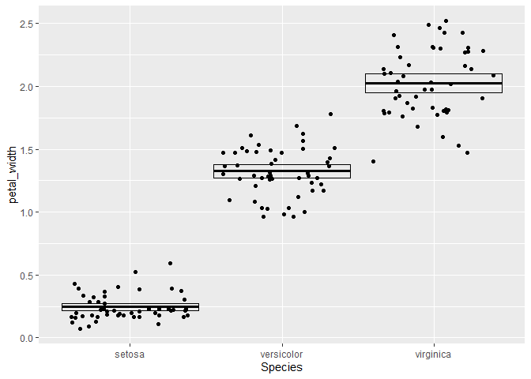

Lab 5 Assignment
================
Michael Slaughter
2021-02-24

Welcome To My Lab 5 Assignment

Here is where we load in the data

``` r
library(tidyverse)
iris <- as_tibble(iris)
```

## Question 1

Rename each variable so that it is all lower-case and uses an underscore
\_ instead of a period . in the name (the recommended coding style in
the tidyverse style guide). Print the resulting table.

``` r
rename(iris, 
sepal_length = Sepal.Length,
sepal_width= Sepal.Width,
petal_width=Petal.Width,
petal_length = Petal.Length)
```

    ## # A tibble: 150 x 5
    ##    sepal_length sepal_width petal_length petal_width Species
    ##           <dbl>       <dbl>        <dbl>       <dbl> <fct>  
    ##  1          5.1         3.5          1.4         0.2 setosa 
    ##  2          4.9         3            1.4         0.2 setosa 
    ##  3          4.7         3.2          1.3         0.2 setosa 
    ##  4          4.6         3.1          1.5         0.2 setosa 
    ##  5          5           3.6          1.4         0.2 setosa 
    ##  6          5.4         3.9          1.7         0.4 setosa 
    ##  7          4.6         3.4          1.4         0.3 setosa 
    ##  8          5           3.4          1.5         0.2 setosa 
    ##  9          4.4         2.9          1.4         0.2 setosa 
    ## 10          4.9         3.1          1.5         0.1 setosa 
    ## # ... with 140 more rows

``` r
iris2 <- rename(iris, 
             sepal_length = Sepal.Length,
             sepal_width= Sepal.Width,
             petal_width=Petal.Width,
             petal_length = Petal.Length)
iris2
```

    ## # A tibble: 150 x 5
    ##    sepal_length sepal_width petal_length petal_width Species
    ##           <dbl>       <dbl>        <dbl>       <dbl> <fct>  
    ##  1          5.1         3.5          1.4         0.2 setosa 
    ##  2          4.9         3            1.4         0.2 setosa 
    ##  3          4.7         3.2          1.3         0.2 setosa 
    ##  4          4.6         3.1          1.5         0.2 setosa 
    ##  5          5           3.6          1.4         0.2 setosa 
    ##  6          5.4         3.9          1.7         0.4 setosa 
    ##  7          4.6         3.4          1.4         0.3 setosa 
    ##  8          5           3.4          1.5         0.2 setosa 
    ##  9          4.4         2.9          1.4         0.2 setosa 
    ## 10          4.9         3.1          1.5         0.1 setosa 
    ## # ... with 140 more rows

## Question 2

Convert the four numerical variables from cm to mm by multiplying by 10.
Print the resulting table.

``` r
mutate(iris2,
       sepal_length=sepal_length*10,
       sepal_width=sepal_width*10,
       petal_width=petal_width*10,
       petal_length=petal_length*10)
```

    ## # A tibble: 150 x 5
    ##    sepal_length sepal_width petal_length petal_width Species
    ##           <dbl>       <dbl>        <dbl>       <dbl> <fct>  
    ##  1           51          35           14           2 setosa 
    ##  2           49          30           14           2 setosa 
    ##  3           47          32           13           2 setosa 
    ##  4           46          31           15           2 setosa 
    ##  5           50          36           14           2 setosa 
    ##  6           54          39           17           4 setosa 
    ##  7           46          34           14           3 setosa 
    ##  8           50          34           15           2 setosa 
    ##  9           44          29           14           2 setosa 
    ## 10           49          31           15           1 setosa 
    ## # ... with 140 more rows

## Question 3

Calculate sepal area and petal area (area is equal to length multiplied
by width). Print a table with only the variables sepal area, petal area,
and species.

``` r
thing_with_areas <-
mutate(iris2,
       sepal_area = sepal_length * sepal_width, 
       petal_area = petal_length * petal_width)

select(thing_with_areas, Species, sepal_area, petal_area)
```

    ## # A tibble: 150 x 3
    ##    Species sepal_area petal_area
    ##    <fct>        <dbl>      <dbl>
    ##  1 setosa        17.8      0.280
    ##  2 setosa        14.7      0.280
    ##  3 setosa        15.0      0.26 
    ##  4 setosa        14.3      0.3  
    ##  5 setosa        18        0.280
    ##  6 setosa        21.1      0.68 
    ##  7 setosa        15.6      0.42 
    ##  8 setosa        17        0.3  
    ##  9 setosa        12.8      0.280
    ## 10 setosa        15.2      0.15 
    ## # ... with 140 more rows

## Question 4

Calculate the following statistics for the entire dataset from the sepal
length variable and print the resulting table:

sample size maximum value minimum value range median first quartile (q1)
third quartile (q2) inter-quartile range (iqr)

``` r
summarize(
        iris2,
        sampl_size= n(),
        max_sepal_length = max(sepal_length),
        min_sepal_length = min(sepal_length),
        range_sepal_length = range(sepal_length),
        med_sepal_length = median(sepal_length),
        q1 = quantile(sepal_length, probs=0.25),
        q3=quantile(sepal_length, probs=0.75),
        IQR_sepal_length = IQR(sepal_length)
        )
```

    ## # A tibble: 2 x 8
    ##   sampl_size max_sepal_length min_sepal_length range_sepal_len~ med_sepal_length
    ##        <int>            <dbl>            <dbl>            <dbl>            <dbl>
    ## 1        150              7.9              4.3              4.3              5.8
    ## 2        150              7.9              4.3              7.9              5.8
    ## # ... with 3 more variables: q1 <dbl>, q3 <dbl>, IQR_sepal_length <dbl>

## Question 5

Calculate the following statistics for each species from the petal width
variable and print the resulting table:

sample size mean standard deviation variance standard error of the mean
approximate 95% confidence interval

``` r
petal_grouped<- group_by(iris2,Species)
# petal_grouped
petal_widthsummary <-
        summarize(
                petal_grouped,
                sampl_size = n(),
                mean_petal_width = mean(petal_width),
                sd_petal_width = sd(petal_width),
                var_petal_width = var(petal_width),
                sem_petal_width = sd_petal_width / sqrt(sampl_size),
                ci_upper_limit = mean_petal_width + 1.96 *
                        sem_petal_width,
                ci_lower_limit = mean_petal_width - 1.96 * sem_petal_width
        )
petal_widthsummary
```

    ## # A tibble: 3 x 8
    ##   Species sampl_size mean_petal_width sd_petal_width var_petal_width
    ## * <fct>        <int>            <dbl>          <dbl>           <dbl>
    ## 1 setosa          50            0.246          0.105          0.0111
    ## 2 versic~         50            1.33           0.198          0.0391
    ## 3 virgin~         50            2.03           0.275          0.0754
    ## # ... with 3 more variables: sem_petal_width <dbl>, ci_upper_limit <dbl>,
    ## #   ci_lower_limit <dbl>

## Question 6

Visualize the relationship between petal width and species using a strip
plot.

``` r
ggplot(data = iris2) +
        geom_jitter(mapping = aes(x = Species, y = petal_width))
```

<!-- -->

## Question 7

Starting with the previous graph, add the mean and 95% confidence
interval for each species

``` r
ggplot(data = iris2)+
        geom_jitter(mapping=aes(x=Species,y=petal_width))+
        geom_crossbar(
                data=petal_widthsummary,
                mapping=aes(x=Species,y=mean_petal_width, ymax = ci_upper_limit,
                            ymin = ci_lower_limit))
```

<!-- -->

## Question 8

Visualize the relationship between petal length, petal width, and
species using a scatterplot. Map the two numerical variables to the x
and y axes and map species to the color and shape aesthetics.

``` r
ggplot(data = iris2)+
        geom_point(mapping=aes(x=petal_length,y=petal_width,color=Species,shape=Species))
```

<!-- -->

sessioninfo()
